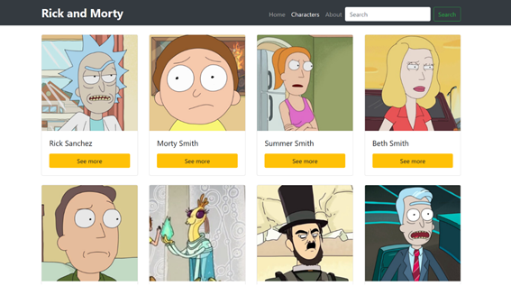

# C5Ta38

<h4></h4><h2></h2><h2>Rick &amp; Morty Frontend App </h2>

Realiza la siguiente interfaz utilizando para ello&nbsp;<a title="Angular" href="https://campus.fundacionesplai.org/mod/url/view.php?id=2959">Angular</a>&nbsp;Framework 12, debes integrar en el proyecto al menos dos&nbsp;<a title="Componentes" href="https://campus.fundacionesplai.org/mod/url/view.php?id=2975">componentes</a>. 

Sobre la API REST&nbsp;<a href="https://rickandmortyapi.com/">https://rickandmortyapi.com/&nbsp;</a>realiza las consultas GET necesarias para pintar la información de varios personajes en tu vista web. Consulta la documentación para poder obtener URIs válidas para cada personaje.&nbsp;

Añade tres enlaces en la parte superior de la página (puedes utilizar un navbar). El primero dará acceso a la pantalla de bienvenida (Home). El segundo mostrará un listado de personajes aleatorio. Y el tercer enlace debe mostrar mediante otra ruta el nombre del programador, versión y fecha de desarrollo (about us). Configura correctamente el sistema de enrutado de&nbsp;<a title="Angular" href="https://campus.fundacionesplai.org/mod/url/view.php?id=2959">angular</a>.

Ejemplo de diseño:

Utiliza para ello la funcionalidad de la clase 'HttpClient'. Se recomienda integrar&nbsp;<a href="https://academia.fundacionesplai.org/mod/msteams/view.php?id=16270" title="Bootstrap">Bootstrap</a>&nbsp;en la interfaz visual&nbsp;incluyendo los Servicios y Pipes que consideres necesario. Define la vista de detalle de cada personaje.

Debes adjuntar las URL de los diferentes repositorios realizados para resolver la tarea (añade node_modules al gitignore). Recuerda que tienes fecha límite de entrega.

 

